Ноутбук: https://colab.research.google.com/drive/1rp5YYQOAMgniDabMWPXgF6zYX6cPzT8s?usp=sharing

Клеточная линия: GM23338

Гистоновая метка: H3K4me3

Реплика 1: ENCFF969HPT

Реплика 2: ENCFF137BVY

Контроль: ENCFF731CEN

# Анализ FastQC

## ENCFF969HPT

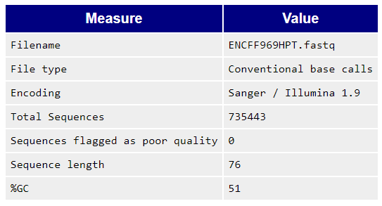
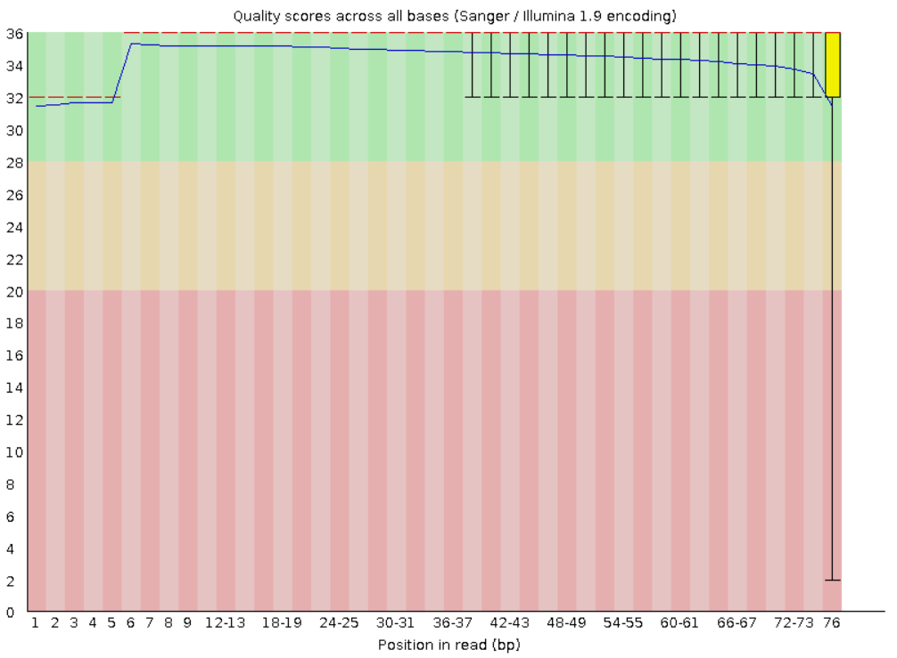
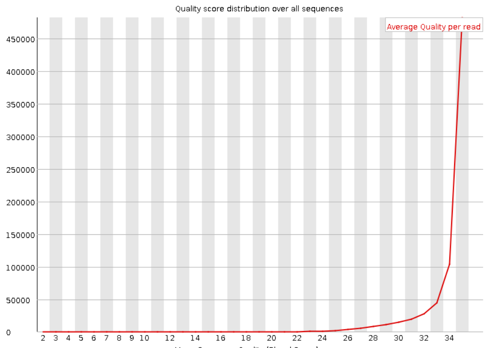
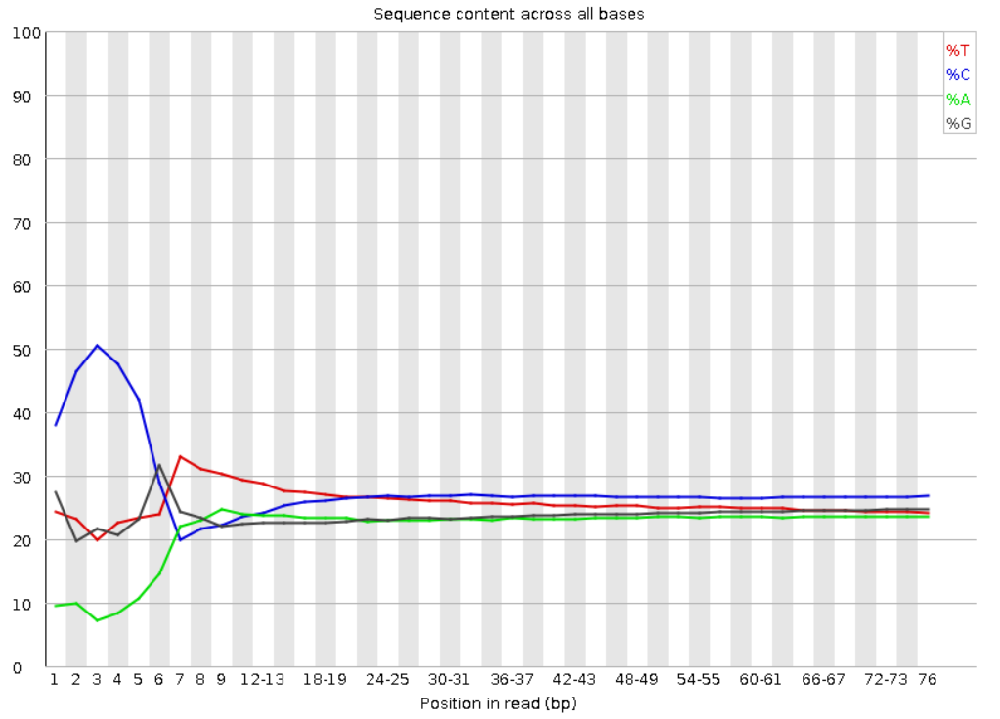
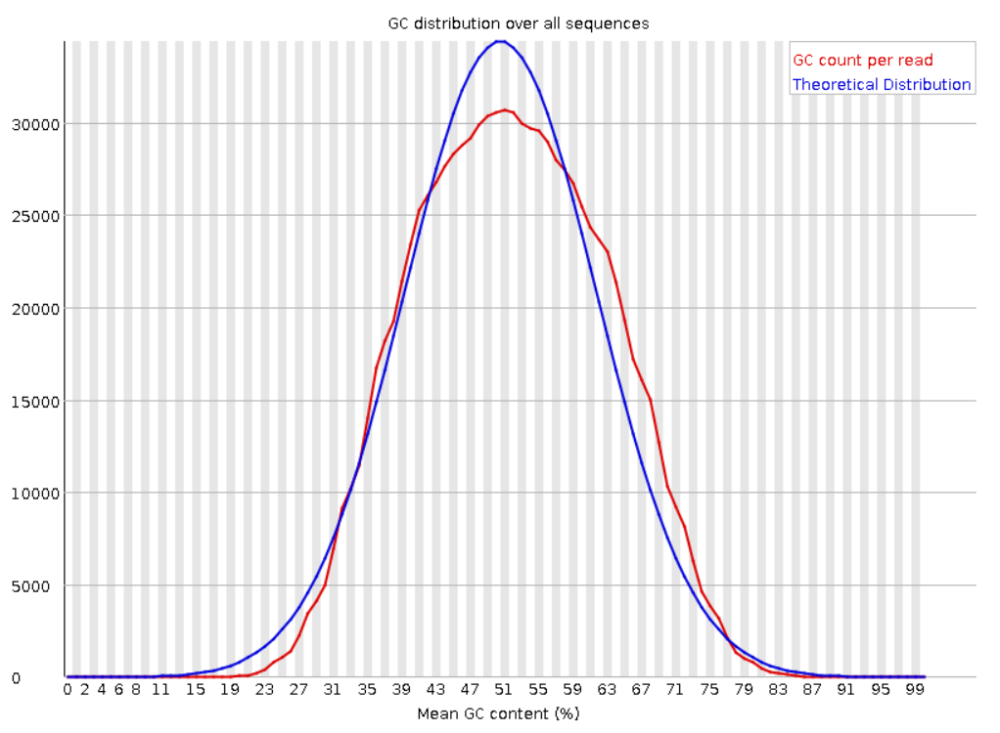

## ENCFF137BVY

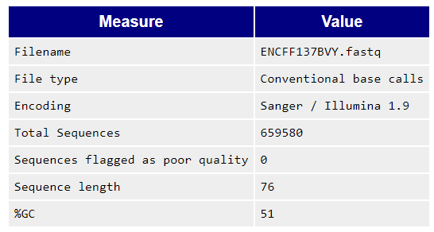

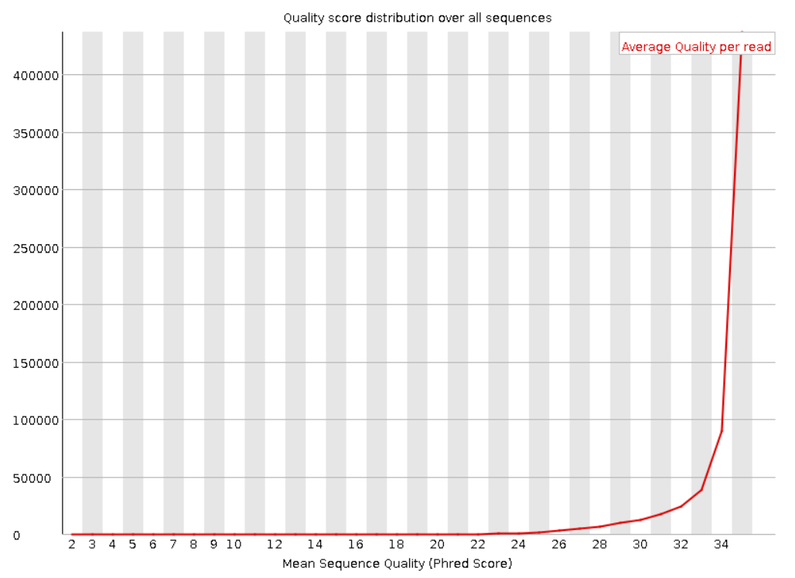
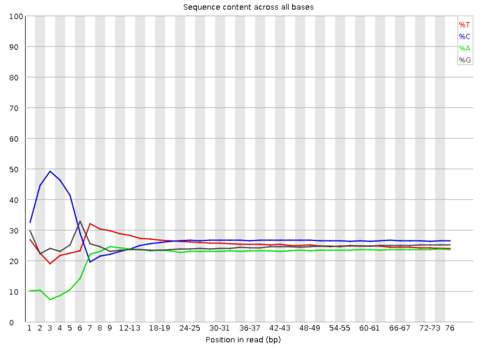
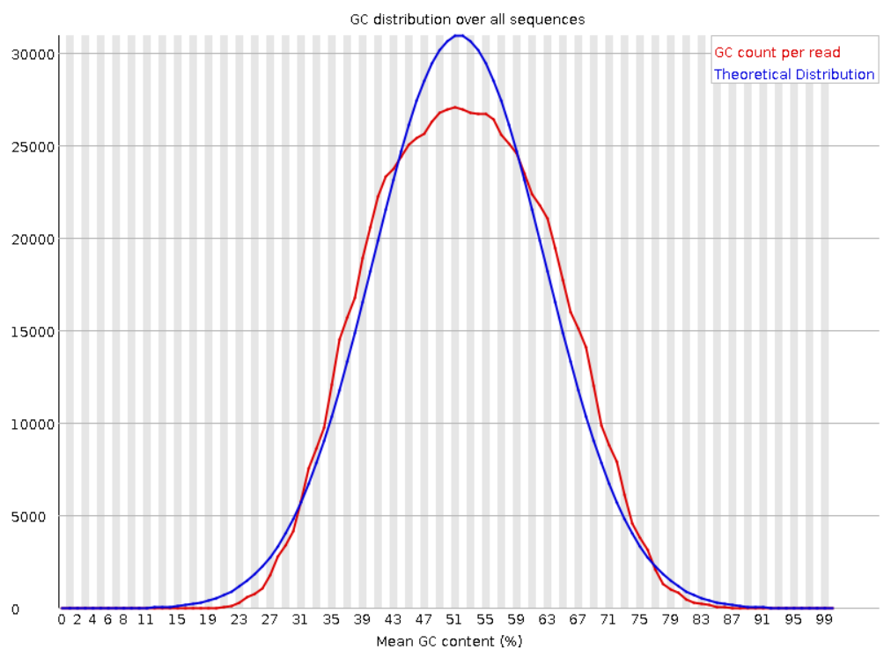

## ENCFF731CEN

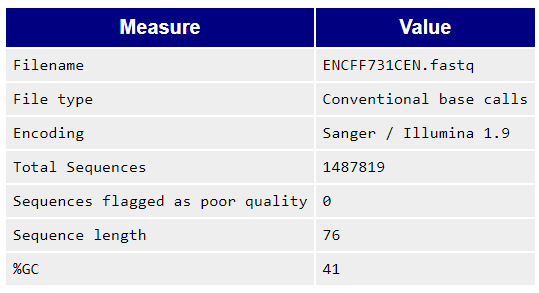
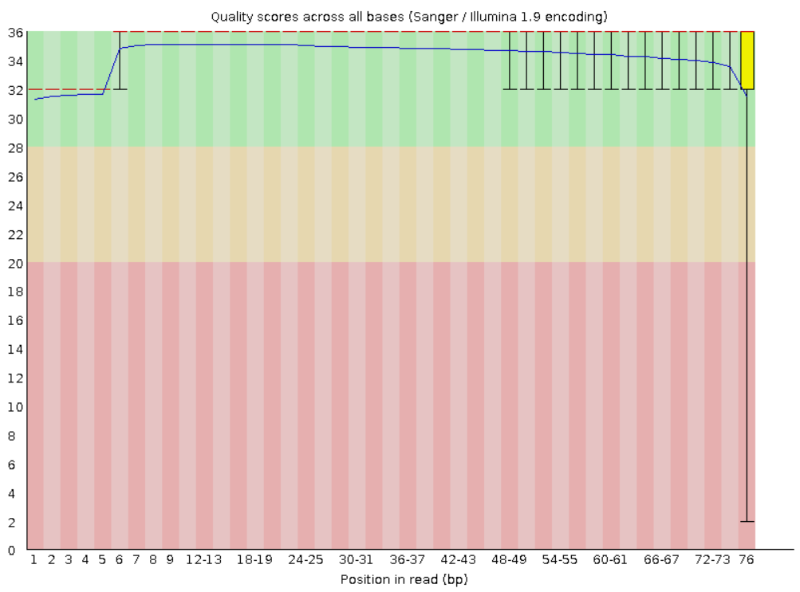
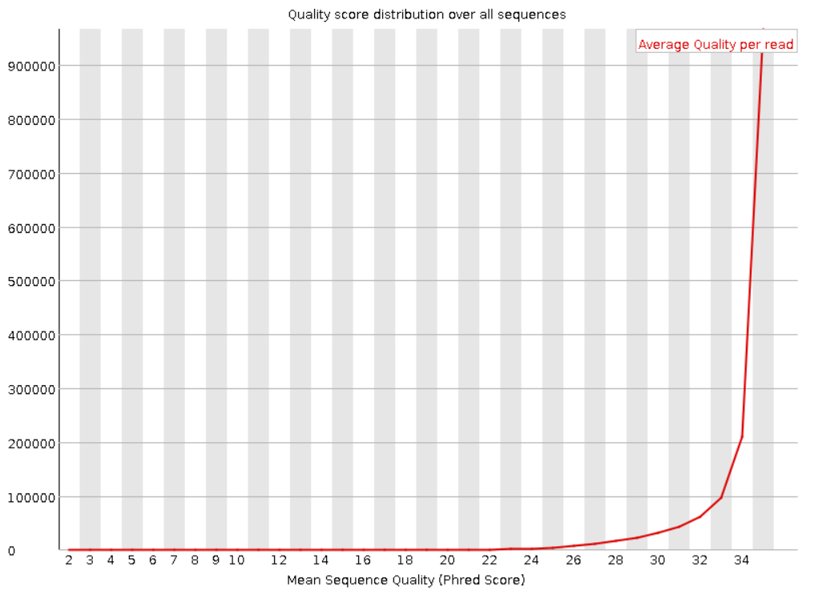
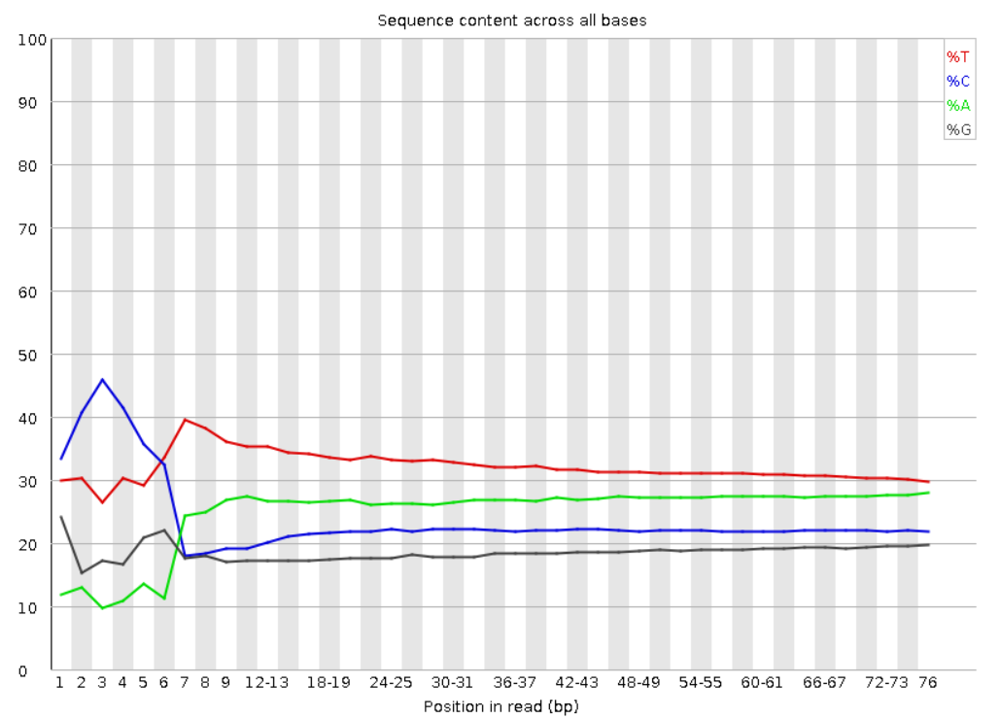
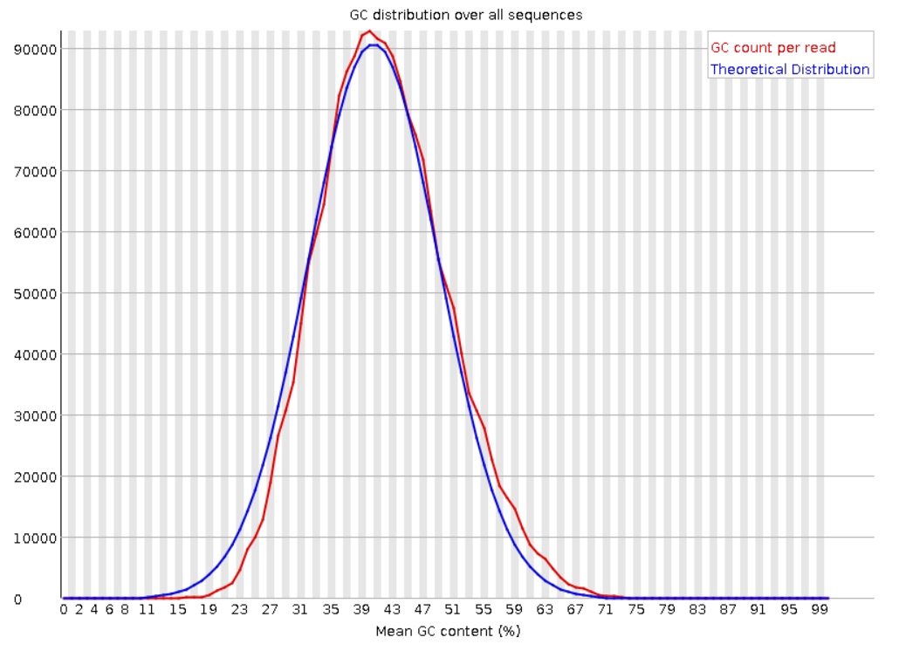

Качество чтений хорошее, поэтому подрезание или фильтрация не нужны.

# Выравнивание на 14 хромосомму

|index|ID|reads|aligned 0 times|aligned 0 times, %|aligned exactly 1 time|aligned exactly 1 time, %|aligned &gt;1 times|aligned &gt;1 times, %|
|---|---|---|---|---|---|---|---|---|
|0|ENCFF969HPT|735443|679268|92\.36%|26700|3\.63%|29475|4\.01%|
|1|ENCFF137BVY|659580|607001|92\.03%|23996|3\.64%|28583|4\.33%|
|2|ENCFF731CEN|1487819|1334112|89\.67%|55458|3\.73%|98249|6\.60%|

Так как выравнивание было сделано только на одну хромосому, которая составляет малую часть генома человека, то процент выравниваний получился низким.

# Peak calling

В выбранных фрагментах нет paired peaks.
